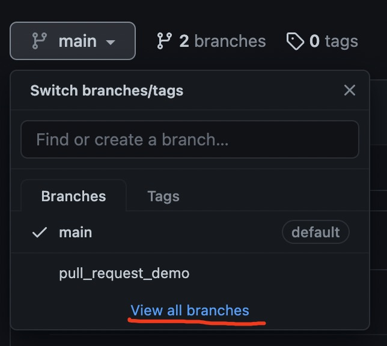
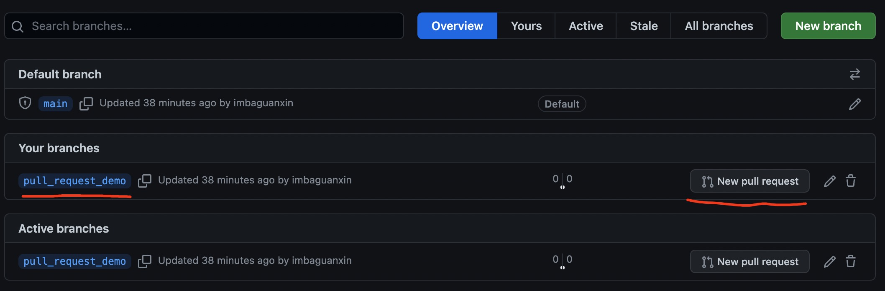
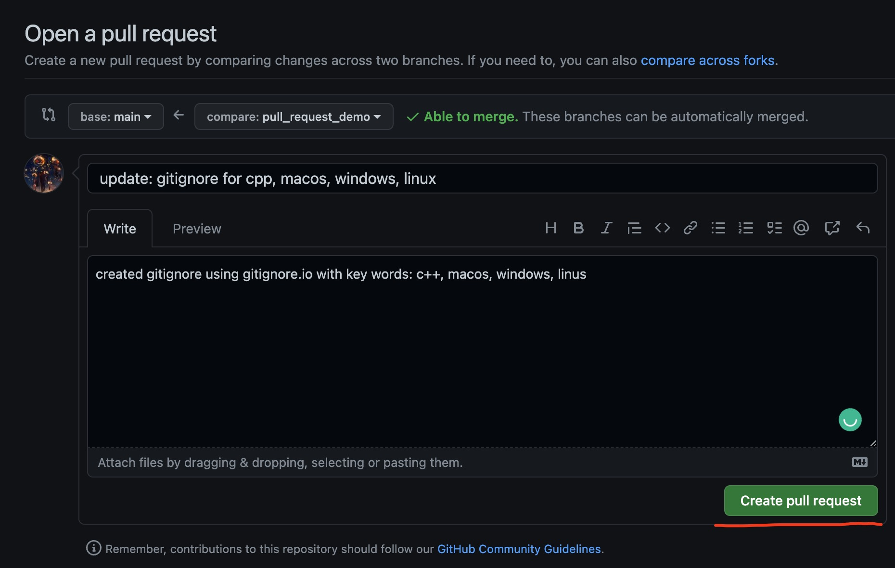

## Final Project

Implement dudojump / jump king

## Team member

- Runpu Meng (runpum)
- Zongyuan Wu (zongyuawu)
- Yu Qiu (yuqiu)
- Yu Wang (yuw6)
- Xin Guan (xinguan)

## Proposal doc

https://docs.google.com/document/d/1SaKPSWloOqdec8N8cuT_aly7W06ZFQhHti2Pu2URppg/edit?usp=sharing

## github working process

1. create a branch
2. write your code in the branch and do commits
    * "fix: xxxxx" used for fix bug
    * "update: xxxxx" used for update new function 
    * "format: xxxxx" used for code formation or refractoring
    * "config: xxxxx" used for change or upload config file
   
   Generally, this 4 category is enough but exceptions are ok. And most of the case you are using **update** and **format**
3. Create a pull request on github and ask one of the team mate to
do code review. 
4. merge into main branch if good. 

- Please periodically pull from main branch.
- Please write comments / docstrings.
- Please do some test before commiting and especially doing pull requests.

## Pull request demo

1. update the repository and make sure it is the newest version

```
git pull
```

2. checkout to the main branch 
```
git checkout main
```

3. create your branch and go to your branch
```
git branch your_branch
git checkout your_branch

# or just simply use
git checkout -b your_branch
```

4. commit your code use git commit and push to server/github
```
git push -u origin your_branch:your_branch
git commit -m "update:xxxx"
git push --set-upstream origin your_branch
```

  This command is actually: `git push -u [remote_server_name] [local_branch_name]:[remote_branch_name]` and `git push --set-upstream [remote_server_name] [remote_branch_name]`. Please change the values if you have different configs. You can use `git remote -v` to check the remote server name.

  Also, you can push your branch before commiting any code. You may push your branch to server once you created the branch.

  After you set the upstream, you are good to use `git push` to commit.

5. Create a pull request on github

  * go to the repository and go to the branch view



  * select your branch and do a pull requet



  * write some meaningfull comments and description. and create pull request



  * wait for someone (could be you, but better not you) to review the code and merge to the main. You can do code review for your friends and approve the merge on github repository page under `Pull requests`.


cuttleqfish@gmail.com
